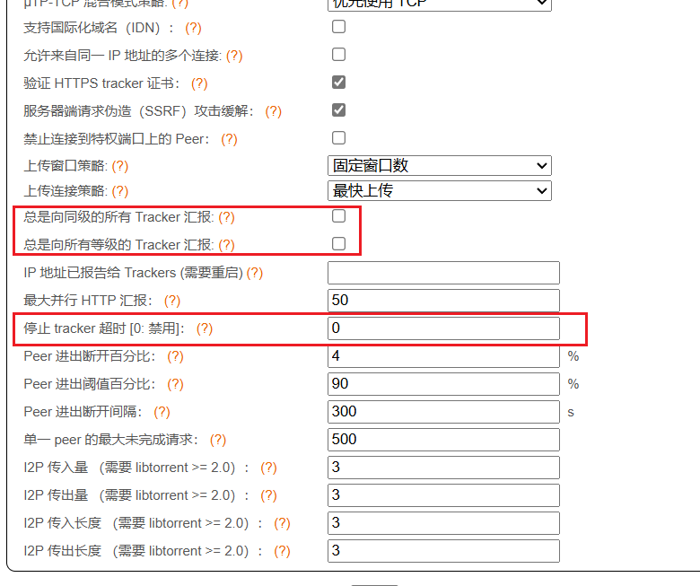
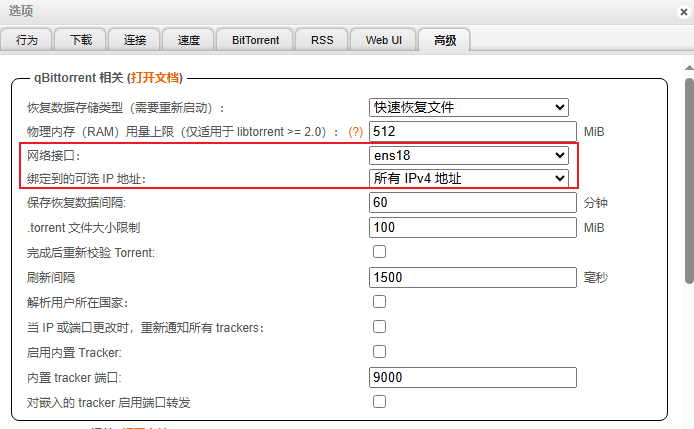

## Autobangumi优化

AutoBangumi高度依赖qBittorrent的稳定性，如果qBittorrent出现卡顿卡死，会导致AutoBangumi也会卡顿卡死。因此需要优化qBittorrent设置防止添加大量种子时卡死。

### 限制tracer广播

一些字幕组的种子会含有上百个tracer，它们互相广播时会卡。

按照如下设置：

限制最大下载数和连接数，确保不会让qBittorrent超负荷。

### 防止出现相同重命名的文件

qBittorrent不会检测文件重命名冲突，如果出现冲突会直接覆盖，然后导致内容错乱、无限检验重试。需要保证重命名不会冲突。

### 设置指定网络端口

在选线 -> 高级 -> 网络接口中选择特定的网络接口，而不是任意网络接口，否则qBittorrent会挨个尝试导致运行缓慢。绑定到可选的ip地址可以选择`所有IPv4地址`，如下图所示：

